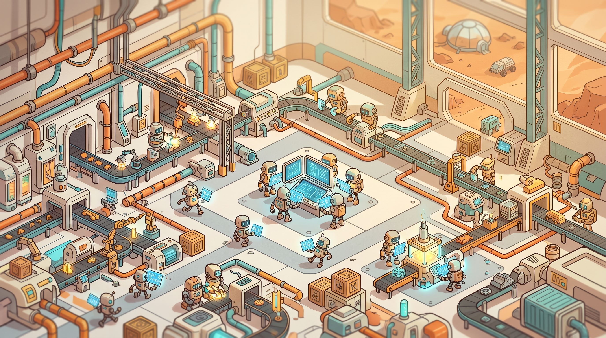

<h1 align="center">clu</h1>

<p align="center">
  
</p>

<p align="center">
  <em>🤖 SQLite-backed issue tracker for coordinating AI coding agents on a single machine.</em><br>
  <em>Named after Tron's <strong>C</strong>odified <strong>L</strong>ikeness <strong>U</strong>tility.</em>
</p>

<p align="center">
  <a href="https://github.com/Rovak/agents-clu/actions"></a>
  <a href="https://goreportcard.com/report/github.com/rovak/clu"></a>
  <a href="https://pkg.go.dev/github.com/rovak/clu"></a>
  
  
  
  
  
</p>

<p align="center">
  <a href="#-quickstart"><strong>Quickstart</strong></a> ·
  <a href="#-multi-agent-setup"><strong>Multi-agent</strong></a> ·
  <a href="#-workflows"><strong>Workflows</strong></a> ·
  <a href="AGENTS.md"><strong>Agent guide</strong></a> ·
  <a href="#-design-notes"><strong>Design</strong></a>
</p>

---

## 🤔 Why?

When you run more than one AI coding session against the same project, they need a shared, durable place to:

- 🤝 pick up work without stepping on each other (atomic claim),
- 📝 record what they tried, what worked, what didn't,
- 🚦 gate risky steps behind human approval,
- 🔓 surface what's unblocked vs. waiting on something else.

`clu` is that place. A small, fast, single-binary CLI backed by a local SQLite database. **No daemon, no server, no account, no network.**

## ✨ Highlights

| | |
|---|---|
| 📦 **Single binary, pure Go** | SQLite via `modernc.org/sqlite` — no CGo, no system libs. |
| 💾 **Local-first** | One file: `.clu/data.sqlite`. Commit `config.yaml`, gitignore the DB. |
| ⚡ **Atomic claim** | `UPDATE … RETURNING` with subquery — racing agents get different issues. |
| 🎯 **Capability routing** | Agents declare capabilities in `config.yaml`; `cap:foo` labels flow to matching agents. |
| 🌊 **Cascading cancel** | `clu cancel <id>` walks the dep graph forward and cancels the whole tail. |
| 🔒 **Named locks** | `clu lock deploy -- ./deploy.sh` for cross-cutting coordination outside the issue graph. TTL-required, leak-proof. |
| 📋 **Workflow templates** | YAML graphs of issues + deps with optional human-approval checkpoints. |
| 🧾 **JSON everywhere** | Every command takes `--json` and emits exactly one JSON value to stdout. |
| 👀 **Watch-driven** | `clu ready --watch` + Claude Code's Monitor tool = push-style task delivery. |
| 🔒 **No network** | No telemetry, no sync, no cloud. Share a tracker? Copy the file. |

## 📦 Install

```bash
go install github.com/rovak/clu/cmd/clu@latest
# or, from a clone:
make install
```

Add `$HOME/go/bin` to your `PATH`. Verify with `clu --help`.

## 🚀 Quickstart

```bash
mkdir my-project && cd my-project
clu init                                    # 📂 creates .clu/ with DB + config
clu create -p 1 "fix the login redirect"          # → clu-a3f8
clu create -d clu-a3f8 "add tests for the redirect"  # 🔗 wires the dep atomically

clu ready                                   # 🟢 what's unblocked?
clu claim                                   # 🎯 atomically take the next one
clu close clu-a3f8                          # ✅ done → unblocks the tests
clu ready                                   # 🟢 tests are now ready
```

That's the whole core loop. See [`demo.sh`](demo.sh) for an end-to-end exercise, or [`AGENTS.md`](AGENTS.md) for the agent-facing operational guide. From inside an agent session:

```bash
clu brief
```

prints the agent guide plus the project's declared agents and who's currently live — pipe it into your agent at session start. 🧠

## 🚦 Status semantics

| status | meaning | downstream effect |
|---|---|---|
| 🟢 `open` | not yet started | normal |
| 🟡 `in_progress` | claimed; an agent is working | normal |
| ✅ `closed` | done successfully | **unblocks** dependents |
| ❌ `cancelled` | abandoned | dependents stay blocked (or cascade-cancel) |

`clu cancel <id>` marks the target **and all transitive descendants** as cancelled — the cascade is the whole point of having a status distinct from `closed`. `clu reopen <id>` reverses either terminal state.

## 🤖 Multi-agent setup

Declare your agents in `.clu/config.yaml`:

```yaml
id_prefix: clu-
agents:
  code-reviewer:
    description: "Reviews Go code for correctness and security"
    capabilities: [go-review, security-review]
  doc-writer:
    description: "Writes README + docs/ updates"
    capabilities: [docs]
```

Then each agent claims from its own lane:

```bash
clu claim --agent code-reviewer --wait --heartbeat
```

`--heartbeat` is opt-in; without it the claim loop doesn't advertise liveness. With it, `clu agent ls` shows who's online and when they were last seen.

Coordinators route work by either **assigning directly** (`clu create -a doc-writer ...`) or **tagging capability** (`clu create --capability docs ...`). Capability-tagged issues in the default lane flow to whichever agent advertises that capability.

### 👁️ Watching for work (the killer combo)

In Claude Code, point the Monitor tool at `clu ready --watch -a <your-name>` and you've got a push-style task feed: clu suppresses unchanged ticks, Monitor turns each new state into one notification. **No polling loops, no `while true`, no `diff` against `seen`.**

```
Monitor: clu ready --watch -a code-reviewer
```

See [AGENTS.md](AGENTS.md) for the full pattern.

## 📋 Workflows

Drop a YAML template into `.clu/templates/`:

```yaml
name: release
vars:
  version: { required: true, pattern: '^\d+\.\d+\.\d+$' }
steps:
  - id: build
    title: "Build {{version}}"
  - id: test
    title: "Test {{version}}"
    needs: [build]
  - id: approve
    type: checkpoint                          # 🚦 human gate
    title: "Approve {{version}} for prod"
    wait: { approval: [alice, bob] }
    needs: [test]
  - id: deploy
    title: "Deploy {{version}}"
    needs: [approve]
```

```bash
clu run release -v version=1.2.3   # → parent + 4 children + deps in one shot
```

Agents drive it by claiming `ready` issues as each step closes; humans clear checkpoint gates via `clu approve <id>`. Failing a checkpoint cascade-cancels the rest of the run. See [`demo-workflow.sh`](demo-workflow.sh) for the full demo.

## 📁 Layout

```
cmd/clu/                 ⌨️  entrypoint
internal/cli/            🧩 one file per kong subcommand
internal/store/          💾 SQLite layer, split by domain
  ├── models.go            bun model types
  ├── migrations.go        manual migrations (PRAGMA user_version)
  ├── issues.go            create/get/close/reopen/cancel/update
  ├── claim.go             ready/claim atomic queries
  ├── deps.go              dependency edges + cycle detection
  └── …                    labels, comments, kv, cron, agents, doctor
internal/workflow/       📋 YAML template loader + planner
internal/config/         ⚙️  config.yaml parsing
.clu/                    📂 per-project storage (DB, config, templates)
```

## 🧠 Design notes

- 🪪 **One identity flag.** `-a` / `--agent` is both the lane filter and the actor identity. No `--as` — single-user local tool, the user/agent distinction was deliberately collapsed.
- 🗄️ **Hand-rolled migrations** via `PRAGMA user_version`. Append-only, never edit an applied migration.
- 🛠️ **Bun + sqlitedialect** for queries. Raw SQL escape hatches in exactly two places: the atomic claim, and the cancel-cascade CTE.
- 🎀 **Kong** for the CLI struct, with struct-tag commands and intermixed flags.

The rationale for each sticky decision lives in [`CLAUDE.md`](CLAUDE.md).

## 🙅 Not in scope

`clu` is deliberately small. It does **not** try to be:

- 🔄 a cross-machine sync layer — copy the file or layer something on top
- 📊 a generic project-management tool — no sprints, milestones, OKRs
- 🔗 a bridge to GitHub / Linear / Jira — trackers integrate with each other badly; pick one
- 🤖 an agent runtime — *you* are the agent; `clu` just gives you somewhere to put the work

## 🤝 Contributing

PRs welcome. Before sending:

```bash
go build ./... && go test ./...
./demo.sh && ./demo-workflow.sh
```

See [`CLAUDE.md`](CLAUDE.md) for code conventions (one file per kong command, sentinel errors per entity, JSON-clean output, etc.).

## 📜 License

MIT — see [LICENSE](LICENSE).

<p align="center">
  <sub>Built for the era of many small agents working together. ⚡</sub>
</p>
