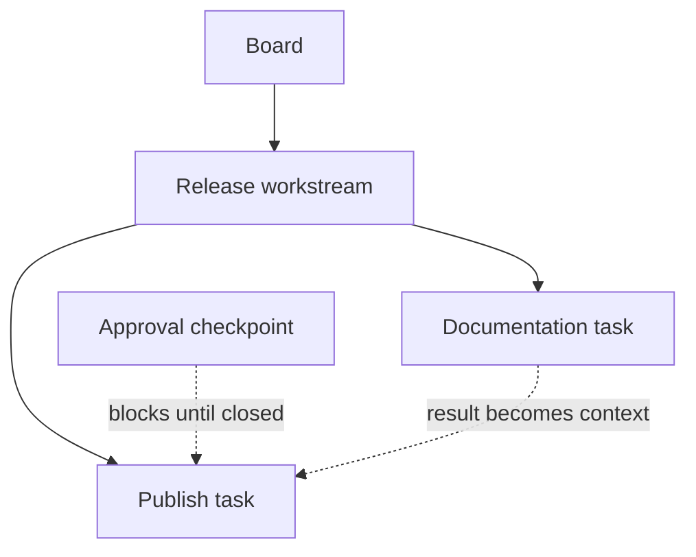
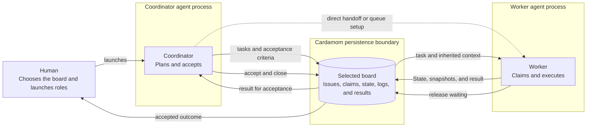
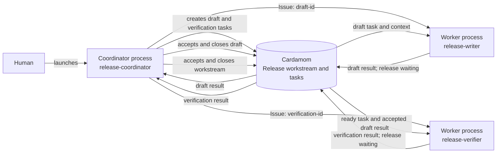
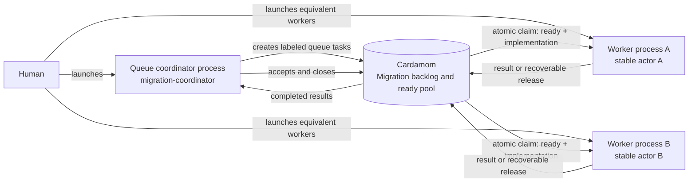
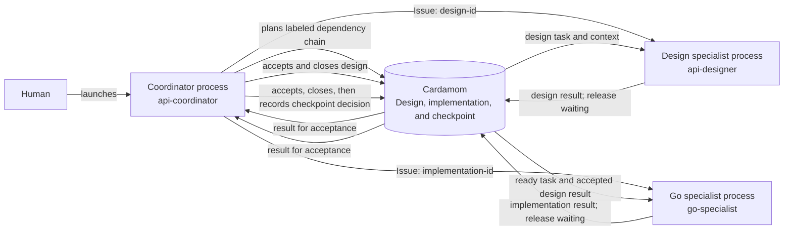

<!--
  This file was generated by `mise run docs`. DO NOT EDIT.
  Edit `doc/guide/README.md` and its linked source files instead.
-->
# Cardamom user guide

- [Installation](#installation)
- [Concepts and issue context](#concepts-and-issue-context)
- [Stores, projects, boards, and setup patterns](#stores-projects-boards-and-setup-patterns)
- [Portable backups](#portable-backups)
- [Workflow recipes](#workflow-recipes)
  - [Coordinator and worker agents](#coordinator-and-worker-agents)
  - [Shared work queue](#shared-work-queue)
  - [Specialist agents](#specialist-agents)
- [Observability](#observability)
- [Mail, subscriptions, leases, and routines](#mail-subscriptions-leases-and-routines)
- [Attachments](#attachments)
- [Markdown collections](#markdown-collections)

## Installation

Install Cardamom for Claude Code, Codex, or as a standalone command.

### Claude Code

1. Add the Cardamom repository marketplace.

   ```bash
   claude plugin marketplace add abhinav/cardamom
   ```

2. Install the plugin.

   ```bash
   claude plugin install cardamom@cardamom
   ```

To update the plugin:

```bash
claude plugin marketplace update cardamom
claude plugin update cardamom@cardamom
```

### Codex

1. Add the Cardamom repository marketplace.

   ```bash
   codex plugin marketplace add abhinav/cardamom
   ```

2. Install the plugin.

   ```bash
   codex plugin add cardamom@cardamom
   ```

To update the plugin:

```bash
codex plugin marketplace upgrade cardamom
codex plugin add cardamom@cardamom
```

### Standalone command

Install the public `card` command directly to use Cardamom from your shell
or with another agent host.

- **Homebrew** or **Linuxbrew**

  ```bash
  brew install --cask abhinav/tap/cardamom
  ```

- **GitHub Releases**

  Pre-built binaries are available on the
  [GitHub Releases](https://github.com/abhinav/cardamom/releases) page.

  ```bash
  mkdir -p "$HOME/.local/bin"
  curl -fsSL "https://github.com/abhinav/cardamom/releases/latest/download/cardamom.$(uname -s)-$(uname -m).tar.gz" |
    tar -xz -C "$HOME/.local/bin" card
  ```

- **Install from source**

  To build and install Cardamom from source, clone the repository,
  set up [Mise](https://mise.jdx.dev/), and run:

  ```bash
  mise run build
  cp bin/card "$HOME/.local/bin"
  ```

After installing `card`,
install its embedded Cardamom skill into an agent host's parent skills
directory:

```bash
card skill install ~/.agents/skills
```

The command writes the skill to `~/.agents/skills/cardamom`.
An identical destination is left unchanged.
If the destination differs,
inspect it before passing `--force` to replace the complete directory.

## Concepts and issue context

Cardamom gives agents a durable graph of work
and a predictable context envelope for each claim.
The graph describes deliverables and ordering.
Claims describe temporary custody.
Issue records preserve the information needed across handoffs.

### The issue graph

Every issue belongs to one board.
A workstream may contain other workstreams, tasks, checkpoints, and routines.
Containment and dependencies answer different questions:

| Relationship | Question                           | Effect                                                 |
|--------------|------------------------------------|--------------------------------------------------------|
| Parent       | Which deliverable owns this issue? | Adds hierarchy and inherited context.                  |
| Dependency   | Which outcome must exist first?    | Blocks readiness and supplies the prerequisite result. |



Use a parent when issues belong to one acceptance boundary.
Use a dependency when later work requires an earlier result.
The same pair may use both relationships when both statements are true.

### Issue types

| Type         | Use                                                                                    |
|--------------|----------------------------------------------------------------------------------------|
| `workstream` | A finite deliverable with persistent context, children, or its own acceptance boundary |
| `task`       | A bounded part of a deliverable that benefits from separate ownership                  |
| `checkpoint` | A required approve-or-deny decision                                                    |
| `routine`    | A reusable operating contract awakened and scheduled outside Cardamom                  |

Workstreams and routines are executable.
A small deliverable may be claimed directly as a workstream
without creating a task merely to hold the implementation.
Routines are claimed explicitly by ID and do not appear in automatic claim
pools.

### Context on claim

Claim with `--context` when the agent needs the inherited contract:

```bash
card --actor worker-a --json claim <issue-id> --context
```

The response includes:

- the selected board description;
- ancestor summaries and current states;
- the claimed issue's summary and state; and
- results from completed direct dependencies.

Details, complete logs, attachments, and terminal descendants remain available
on demand.
This progressive disclosure keeps the initial handoff small
without making deeper evidence inaccessible.

### Durable records

Each issue record serves one handoff need:

| Record  | Contents                                                        |
|---------|-----------------------------------------------------------------|
| Title   | Compact identity for lists and commands                         |
| Summary | Concise stable contract inherited by descendants                |
| Details | Expanded stable rationale, procedure, and examples              |
| State   | Current recovery truth and an optional next action              |
| Log     | Committed State snapshots and additional replay-worthy material |
| Result  | Durable outcome for acceptors and direct dependents             |

Replace State whenever the recovery truth or planned transition changes.
Keep the recovery facts in the State body
and pass the optional planned transition with `--next`.
At a durable checkpoint,
commit the changed State before dependent work relies on it:

```bash
card --actor worker-a state set "$issue" \
  "The signed release archive is verified." \
  --next "Publish the release notes."
card --actor worker-a state commit "$issue"
```

The commit preserves a State snapshot in the Log
while retaining the current State.
Use `log post` only for additional replay-worthy reasoning or evidence
that the State snapshot does not represent.

Mail is expiring communication,
not an issue record.
Attachments preserve file bytes,
but the issue record must still explain what those bytes establish.

### Lifecycle and custody

Issue lifecycle is `open`, `closed`, or `cancelled`.
An active claim is separate from lifecycle.
Presentation shows an open claimed issue as `in_progress`,
but only the claiming actor owns custody.

Choose the transition that matches the next reader:

| Situation                                    | Operation                                                                      |
|----------------------------------------------|--------------------------------------------------------------------------------|
| Active work reaches a durable checkpoint     | Keep State current, then `state commit`.                                       |
| Work is complete under the current actor     | Set a result when useful, keep final State current, then `close`.              |
| Any eligible worker may continue             | Keep State and its optional next action current, then ordinary `release`.      |
| A named acceptor or external event acts next | Set a useful result or recovery position, then `release --waiting "<reason>"`. |
| Work is no longer valid                      | Inspect dependent cancellation impact, keep State current, then `cancel`.      |

Release and terminal lifecycle operations preserve changed State
as a Log snapshot automatically.
Do not run `state commit` only to prepare for one of those operations.

Claims do not expire because an actor is silent.
Waiting issues remain open and unclaimed,
but automatic claim pools omit them until a direct claim resumes the issue.

## Stores, projects, boards, and setup patterns

A store is the physical persistence boundary selected by `--store`,
`CARDAMOM_STORE`,
or automatic discovery.
A project is the repository or product namespace within that store.
A board is an explicitly created shared coordination context within a project.
Boards do not nest,
and every issue belongs to one board.

| Scope   | Owns                                                                                        |
|---------|---------------------------------------------------------------------------------------------|
| Store   | Physical database, projects, actor mailboxes, topic subscriptions, and resource lease names |
| Project | Repository or product namespace inside a store                                              |
| Board   | Description, issues, graph relationships, claims, records, and attachments                  |

Store selection and board selection are independent.
A shared store can hold several projects and boards
without merging their issue graphs.

### Default project-local setup

`card init` creates a `.cardamom` store in the current project by default.
It also creates the project namespace and a first board named after the project
directory unless `--board-name` overrides the name
or `--no-board` skips board creation.
The project issue prefix defaults to a normalized form of the project directory
basename.
An active store prefix takes precedence over inference,
and `--prefix` sets a project override.
Repeated initialization keeps the existing project prefix
unless `--prefix` explicitly replaces it.

```bash
card --actor coordinator init
```

Use this layout when one repository owns the coordination state
and agents can discover it from the repository path.

### External or user-level store

Select an external store when several checkouts need one physical coordination
boundary or when the store should not live in the repository:

```bash
export CARDAMOM_STORE="$HOME/.local/share/cardamom/team"
card --actor coordinator init
card --actor coordinator --json info
```

With an explicit store,
the current working directory still supplies the project identity
and inferred first-board name.
Use a stable actor name across the claim, record, result, release,
mail, and lease operations that one process owns.

### Linked Git worktrees

Store selection precedence is `--store`,
then `CARDAMOM_STORE`,
then automatic discovery.
Automatic discovery searches ancestor directories
and shares the common store across linked Git worktrees.

This lets an isolated worktree use the repository's existing project and boards
without copying the database into the worktree.
Pass `--store` and `--board` explicitly in delegated work
when ambient discovery or checkout selection is not part of the handoff.

### Multiple projects

Add another repository or product namespace to the selected store explicitly:

```bash
card --actor coordinator --json project list
card --actor coordinator --json project create \
  --prefix payments- "Payments"
```

`project create` returns the new project ID.
Use that ID when creating the project's first board:

```bash
card --actor coordinator --json board create \
  --project <project-id> "Payments delivery"
```

Project creation does not create or select a board.
Project names need not be unique,
so use the stable project ID when a name is ambiguous.
Without `--prefix`,
the new project inherits an active store prefix
or stores a prefix inferred from its name.

### Multiple boards

Store configuration lives at `config.yaml` inside the resolved physical store.
The default store therefore uses `.cardamom/config.yaml`,
while a redirect uses `config.yaml` in the redirect target.
Initialization excludes the database and attachment blobs from the local Git
checkout without excluding `config.yaml`.

Board selection is separate from store selection.
Use `--board` or `CARDAMOM_BOARD` for one invocation,
or persist the selection for the current checkout:

```bash
card --actor coordinator board create "Release 1.5"
card --actor coordinator board use "Release 1.5"
card --actor coordinator --json board show
```

Without an explicit selection,
`card` uses the checkout selection or the store's sole board.
When several boards are eligible and none is selected,
board-scoped commands fail instead of guessing.
Creating or selecting a board never changes the physical store.

Choose a board for the coordination boundary whose description,
issue graph,
and claims should be shared.
That may be a repository,
a release effort,
or another project-specific unit.
Do not use separate boards merely to classify issues;
labels and workstream containment handle classification within one graph.

## Portable backups

`card backup` writes complete boards to one portable archive.
Each included board carries its complete board data
and every committed attachment file.

### Choose boards to back up

By default,
`card backup` uses the selected board:

```bash
card --actor operator backup cardamom-backup
```

Repeat `--include-board` to select complete boards by stable ID
or exact name:

```bash
card --actor operator backup release-backup \
  --include-board "Release planning" \
  --include-board board_74b8c15f
```

Use `--all` to include every board in the selected store:

```bash
card --actor operator backup full-store-backup --all
```

### Restore an archive

`card restore` loads every board in the archive.
Use `--store` to select an existing destination store
or a path for a new store:

```bash
card --actor operator \
  --store "$HOME/.local/share/cardamom/restored" \
  restore full-store-backup
```

Restore retains each archived project's identity.
Cardamom adds the archived projects and boards
without replacing unrelated data already in the destination.
If the destination has the same project identity with incompatible metadata,
the restore fails instead of combining the projects.

### Retry a restore

Restores are safe to retry.
Run the same `card restore` command again after an interruption.
Cardamom resumes with boards that remain to be restored
and reports boards that were restored previously,
without creating duplicate copies.

## Workflow recipes

Every recipe uses the same durable lifecycle:
a human launches agent processes,
agents exchange tasks and results through Cardamom,
and an acceptor closes completed work.



During execution,
State holds current recovery truth and an optional `--next` transition.
Workers commit State at durable checkpoints.
Release and terminal lifecycle operations preserve changed State automatically;
standalone Log posts hold only additional replay-worthy material.

Choose the topology that matches how work should be routed:

| Pattern                                                         | Human setup choice                                          | Task routing                                            |
|-----------------------------------------------------------------|-------------------------------------------------------------|---------------------------------------------------------|
| [Coordinator and worker agents](#coordinator-and-worker-agents) | One coordinator and a worker process for each assigned task | The coordinator sends each worker a specific issue ID.  |
| [Shared work queue](#shared-work-queue)                         | One coordinator and several equivalent worker processes     | Each worker atomically claims any matching ready issue. |
| [Specialist agents](#specialist-agents)                         | One coordinator and a process for each required capability  | Dependencies release capability-specific work in order. |

Start Claude or Codex in the project with the Cardamom skill installed
and the intended board selected.
Different roles may use different agent runtimes.
Give every concurrent process a distinct, stable actor identity.

### Coordinator and worker agents

Use this pattern when one coordinator defines a deliverable,
dispatches bounded tasks,
and retains the acceptance boundary.



#### Human setup

Start one coordinator process with the selected board.
The coordinator plans the workstream,
dispatches tasks,
and owns acceptance.
For each ready task,
start a worker process with its own actor identity
and the issue ID supplied by the coordinator.

Replace angle-bracket placeholders before launching an agent.

<details>
<summary>Coordinator prompt</summary>

```text
Use the Cardamom skill as the governing coordination protocol.
Work on the selected board as actor release-coordinator.
Coordinate preparation and publication of the 1.5 release.
Create one workstream with a task to draft release notes from accepted changes
and a dependent task to verify the notes against the release archive.
Dispatch each task to a worker with its own stable actor identity.
Retain responsibility for accepting worker results and closing the workstream.
```

</details>

<details>
<summary>Directed worker prompt</summary>

```text
Store: <store-path>
Board: <board-id-or-name>
Issue: <issue-id>

Use the Cardamom skill as the governing coordination protocol.
Work in the project as actor release-writer.
Use the Cardamom store and board above.
Claim issue <issue-id> by ID with inherited context.
Complete the assigned release task.
Keep State aligned with current recovery truth
and put an optional planned transition in `--next`.
Commit State at durable checkpoints.
Use standalone Log posts only for replay-worthy material
that State snapshots do not represent.
Set a useful result and release the task waiting for coordinator acceptance.
```

</details>

#### After launch

The coordinator stores the deliverable and acceptance criteria in the
workstream,
then gives each worker a specific issue ID.
The worker claims that ID with context,
keeps State current,
commits durable checkpoints,
sets a result,
and releases waiting.
Release preserves any changed final State automatically.

The coordinator inspects each result,
records acceptance,
and closes the task.
Closing the drafting task makes the dependent verification task ready
and supplies the accepted drafting result as claim context.
The coordinator closes the workstream after every direct child is closed
or cancelled.

### Shared work queue

Use this pattern when several equivalent workers may claim the next ready item
without a coordinator assigning a specific issue.



#### Human setup

Start one coordinator process to define the workstream and acceptance criteria.
Then start one process per equivalent worker.
Give every worker the same role prompt,
but require each process to choose a distinct actor identity.

<details>
<summary>Queue coordinator prompt</summary>

```text
Use the Cardamom skill as the governing coordination protocol.
Work on the selected board as actor migration-coordinator.
Create or reconcile a Migration backlog workstream.
Add independently claimable tasks for migrating customer preferences and
notification settings, and label both tasks implementation.
Define acceptance criteria, but do not assign tasks to particular workers.
Accept completed results and close the workstream after its tasks are closed.
```

</details>

<details>
<summary>Shared worker prompt</summary>

```text
Use the Cardamom skill as the governing coordination protocol.
Work on the selected board.
Before the first Cardamom command, choose a stable actor identity that
distinguishes this session from every concurrent migration worker.
Find the Migration backlog workstream and atomically claim one ready task under
it with the implementation label and inherited context.
Carry out the claimed task and keep State aligned with current recovery truth.
Put an optional planned transition in `--next`
and commit State at durable checkpoints.
Use standalone Log posts only for replay-worthy material
that State snapshots do not represent.
If any migration worker may resume unfinished work, release it to the pool.
When the task is complete, set a useful result and release it waiting for
migration-coordinator acceptance.
```

</details>

#### After launch

Containment limits the claim pool to one deliverable,
and labels select the kind of work each worker may claim.
Dependencies alone control readiness.
Each atomic claim gives one ready issue to one worker.

An ordinary release returns unfinished work to the pool after the worker
records current State and an optional next action.
Release preserves changed State automatically.
Completed work receives a result and waiting status instead.
The coordinator inspects each completed result,
records acceptance,
and closes the issue without taking execution custody.

### Specialist agents

Use this pattern when different agents own distinct capabilities
and later work depends on earlier specialist results.



#### Human setup

Start one coordinator process to define the capability labels,
dependency order,
and acceptance criteria.
When a specialist task becomes ready,
start a process with that capability and give it the assigned issue ID.

Replace angle-bracket placeholders before launching a specialist.

<details>
<summary>Specialist coordinator prompt</summary>

```text
Use the Cardamom skill as the governing coordination protocol.
Work on the selected board as actor api-coordinator.
Plan delivery of an API change as a design task, a dependent Go implementation
task, and a final approval checkpoint.
Label the design task design and the implementation task go.
Define the public contract and acceptance criteria in the issue summaries.
Accept each specialist result before closing its task.
Keep the final authority decision at the checkpoint.
```

</details>

<details>
<summary>Design specialist prompt</summary>

```text
Store: <store-path>
Board: <board-id-or-name>
Issue: <issue-id>

Use the Cardamom skill as the governing coordination protocol.
Work in the project as actor api-designer.
Use the Cardamom store and board above.
Claim issue <issue-id> by ID with inherited context.
Define the public request and response contract.
Keep State aligned with current recovery truth
and put an optional planned transition in `--next`.
Commit State at durable checkpoints.
Use standalone Log posts only for replay-worthy material
that State snapshots do not represent.
Set the design result and release the task waiting for api-coordinator
acceptance.
```

</details>

<details>
<summary>Go specialist prompt</summary>

```text
Store: <store-path>
Board: <board-id-or-name>
Issue: <issue-id>

Use the Cardamom skill as the governing coordination protocol.
Work in the project as actor go-specialist.
Use the Cardamom store and board above.
Claim issue <issue-id> by ID with inherited context.
Implement the accepted API contract and its contract tests.
Keep State aligned with current recovery truth
and put an optional planned transition in `--next`.
Commit State at durable checkpoints.
Use standalone Log posts only for replay-worthy material
that State snapshots do not represent.
Set the implementation result and release the task waiting for api-coordinator
acceptance.
```

</details>

#### After launch

Labels identify the capability required for each task.
Dependencies,
not labels,
control when the next task becomes ready.
Each specialist claims the assigned issue ID,
records a result,
and releases waiting for coordinator acceptance.

Closing the design task makes implementation ready.
The implementation claim context includes the accepted design result,
so the handoff does not depend on chat history.
After implementation closes,
the checkpoint becomes actionable
and Cardamom records the authority decision established by the surrounding
process.

## Observability

Cardamom exposes the same coordination state through CLI reads,
a local web interface,
and generated Markdown collections.
Choose the surface that matches the reader.

### CLI inspection

Read the work that is ready to begin:

```bash
card --actor observer ready
```

Read one issue with its board, ancestor,
and direct-dependency context:

```bash
card --actor observer show <issue-id> --context
```

Agents and scripts add `--json` when they need structured output.
For example, `ready` emits JSON Lines:

```bash
card --actor observer --json ready
```

### Local web interface

Start the browser interface from a checkout with a selected board:

```bash
card --actor observer web
```

The interface supports issue lists,
a board view,
issue editing,
log entries,
dependencies,
and checkpoint decisions.
It displays the board selected by the running `card web` process.

Use `--no-browser` when another process manages navigation
or when the server runs without a desktop session:

```bash
card --actor observer web --bind 127.0.0.1 --port 5757 --no-browser
```

Use `--read-only` when the browser server must not change Cardamom state:

```bash
card --actor observer web --read-only
```

Read-only mode rejects browser API operations that may have side effects.
Browser reads and raw attachment downloads remain available,
and direct `card` CLI commands keep their ordinary access.

### Aggregate dashboard

Use `--source` to browse one or more Cardamom web servers
through one read-only dashboard:

```bash
card web \
  --source laptop=http://127.0.0.1:5757 \
  --source builder=http://127.0.0.1:5758
```

Each source is an `alias=URL` pair.
The aggregate dashboard does not open a local Cardamom store.

### Review without a live process

Use a [Markdown collection](#markdown-collections)
when reviewers need a deterministic,
browseable snapshot that can be committed or shared separately.
The collection is a one-way publication,
not a second writable Cardamom store.

## Mail, subscriptions, leases, and routines

Issue claims and records are the durable coordination core.
Cardamom also provides store-scoped communication,
time-limited resource ownership,
and reusable operating contracts.
These features complement issue custody rather than replacing it.

### Choose the durable boundary

| Need                                            | Use               |
|-------------------------------------------------|-------------------|
| Own a unit of work                              | Issue claim       |
| Preserve a decision, recovery state, or outcome | Issue record      |
| Notify one actor briefly                        | Mail              |
| Notify current subscribers to a topic           | Topic publication |
| Own an external resource for a bounded time     | Lease             |
| Repeat one stable operating contract            | Routine           |

### Ephemeral mail

Mail is addressed to an actor and expires.
It belongs to the store rather than one board.
Send a short notification,
then keep material decisions in the relevant issue:

```bash
card --actor coordinator mail send worker-a \
  "Issue cm-abcd is ready for execution."
card --actor worker-a mail recv
```

Use `mail recv --peek` to inspect unread messages without marking them read.
Mail must not be the only copy of a handoff state or accepted decision.

### Topic subscriptions

Subscriptions route ephemeral publications to matching actor mailboxes:

```bash
card --actor release-watcher mail subscribe 'release.*' --ttl 30m
card --actor scheduler mail publish release.ready \
  "A release checkpoint is ready."
card --actor release-watcher mail recv
```

Subscription patterns use filepath-style globs.
Subscriptions expire,
and `mail recv --tail` does not refresh their lifetime.

### Resource leases

A lease coordinates exclusive access to a named external resource,
such as a shared test account,
device,
or local port:

```bash
card --actor worker-a lease acquire staging-db --ttl 30m
card --actor worker-a lease renew staging-db --ttl 30m
card --actor worker-a lease release staging-db
```

Leases are store-scoped.
Use the same stable resource name wherever access must contend.
Lease expiry ends Cardamom ownership,
but it does not prove that the external resource is clean or idle.

### Routines

A routine stores one reusable operating contract.
Scheduling and wake policy stay outside Cardamom,
and each run claims the known routine ID:

```bash
card --actor routine-worker --json claim <routine-id> --context
card --actor routine-worker state set <routine-id> \
  "Inspecting pull requests after safe cursor 120."
```

The replacement keeps State aligned with the active run.
Omitting `--next` clears the planned transition consumed by this run.

At the end of the run,
append its outcome to State,
then commit that checkpoint while installing the next-run recovery truth:

```bash
card --actor routine-worker state append <routine-id> \
  "Reviewed through pull request 124; its test job is still failing."
card --actor routine-worker state commit <routine-id> \
  --set "Pull request 124 is unresolved. Safe cursor: 124." \
  --next "Recheck pull request 124."
card --actor routine-worker release <routine-id>
```

The commit preserves the completed run as a State snapshot.
Release preserves the changed next-run State automatically.
Use `log post` only for additional replay-worthy material
that neither State snapshot represents.
Create child tasks only when part of the run needs independent ownership,
dependencies,
artifacts,
or acceptance.

## Attachments

Use an attachment when file bytes must survive the producing path,
process,
session,
or worktree.
Keep the meaning of those bytes in an issue record.

| Information                                    | Storage                                       |
|------------------------------------------------|-----------------------------------------------|
| Contract, current state, reasoning, or outcome | Issue summary, details, state, log, or result |
| File bytes needed by a later agent or acceptor | Attachment referenced from an issue record    |

### Add and reference a file

Upload the file with the issue where it entered the board:

```bash
card --actor worker-a attachment add --issue "$issue" report.txt
```

The command displays the attachment ID,
the file link,
and the image reference:

```text
att_yfivg2cnkcjaorkasemozcjiqa
[report.txt](attachment:att_yfivg2cnkcjaorkasemozcjiqa)

```

Use the displayed ID in a durable record where the file's meaning is clear:

```bash
card --actor worker-a log post "$issue" \
  "Validation report: %att_yfivg2cnkcjaorkasemozcjiqa"
```

Agents and automation can capture the ID from structured output:

```bash
artifact_id=$(
  card --actor worker-a --json attachment add \
    --issue "$issue" report.txt |
    jq -r .id
)
```

Use `%<attachment-id>` when the stored filename is suitable link text.
Use `[label](attachment:<id>)` for a custom file label
or `` for an image.

Attachments belong to one board.
Their optional issue association records where the bytes entered the board;
other issues on the same board may reference the same attachment.

### Retrieve verified bytes

Inspect metadata and replica-local availability before depending on an
attachment,
then download it to a new path:

```bash
card --actor recovery-worker --json attachment show <attachment-id>
card --actor recovery-worker --json attachment get \
  <attachment-id> recovered-report.txt
```

`attachment get` verifies the complete content
and refuses to replace an existing output path unless `--force` is supplied.
When only the originating issue is known,
use `attachment list --issue <issue-id>` and follow `next_page_token`
until it is absent.

## Markdown collections

`card dump` writes a one-way Markdown view of one board.
The generated files are designed for browsing or committing to a repository;
they are not an interchange or import format.

Dump the whole board to create or update a collection:

```bash
card --actor publisher dump docs/board
```

A whole-board dump writes `README.md` and one canonical page for every issue,
including open, in-progress, closed, and cancelled issues.
All issue pages live at `issues/<id>.md`.

Select one or more issues with repeatable `--issue` flags.
Each flag also accepts comma-separated IDs:

```bash
card --actor publisher dump docs/board \
  --issue cardamom-release \
  --issue cardamom-docs,cardamom-review
```

Each selected issue includes all of its containment descendants by default.
Use `--no-descendants` to include only the issue IDs named by `--issue`:

```bash
card --actor publisher dump docs/board \
  --issue cardamom-release \
  --no-descendants
```

An issue-selected dump updates only the selected canonical pages.
It does not write `README.md`,
and it preserves existing pages for issues outside the selection.
This makes repeated commands an additive collection for the same board.

Every generated file carries private YAML frontmatter under `cardamom`.
The metadata records the owning board,
the generated file identity,
and a digest of the Markdown body so `card` can recognize later modifications.
Unowned files in the destination remain outside the collection.

By default,
`card dump` refuses to replace a recognized generated file whose body changed
after generation.
Use `--force` to repair that modified generated file from the board:

```bash
card --actor publisher dump docs/board \
  --issue cardamom-release \
  --force
```

`--force` does not override ownership or path safety.
It cannot replace unowned files,
files generated from another board,
or files at unsafe or noncanonical paths.
