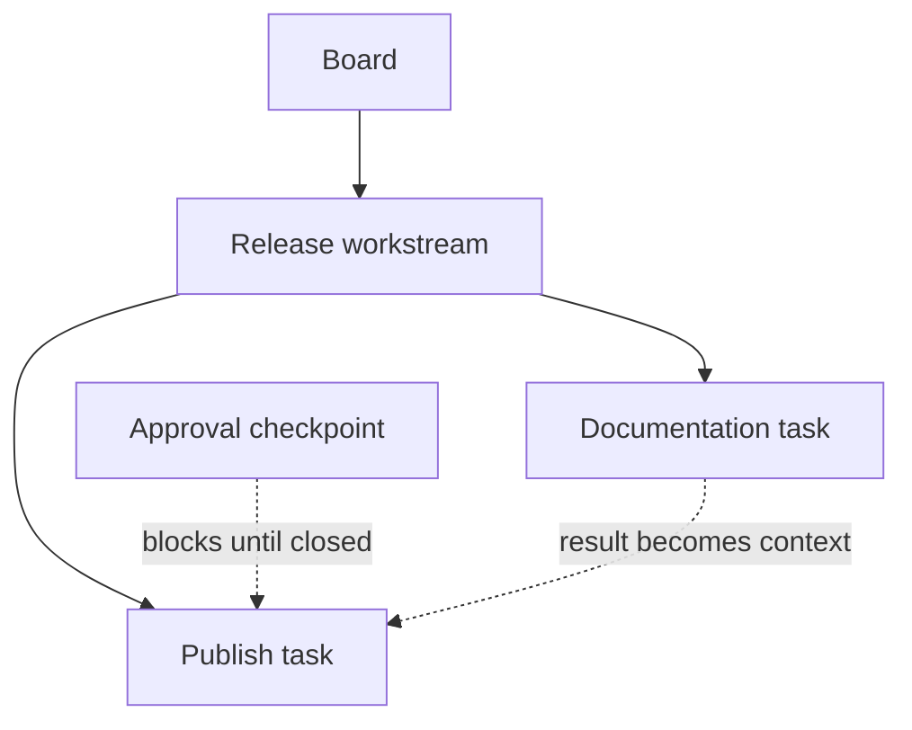

# Concepts and issue context

Cardamom gives agents a durable graph of work
and a predictable context envelope for each claim.
The graph describes deliverables and ordering.
Claims describe temporary custody.
Issue records preserve the information needed across handoffs.

## The issue graph

Every issue belongs to one board.
A workstream may contain other workstreams, tasks, checkpoints, and routines.
Containment and dependencies answer different questions:

| Relationship | Question | Effect |
| --- | --- | --- |
| Parent | Which deliverable owns this issue? | Adds hierarchy and inherited context. |
| Dependency | Which outcome must exist first? | Blocks readiness and supplies the prerequisite result. |



Use a parent when issues belong to one acceptance boundary.
Use a dependency when later work requires an earlier result.
The same pair may use both relationships when both statements are true.

## Issue types

| Type | Use |
| --- | --- |
| `workstream` | A finite deliverable with persistent context, children, or its own acceptance boundary |
| `task` | A bounded part of a deliverable that benefits from separate ownership |
| `checkpoint` | A required approve-or-deny decision |
| `routine` | A reusable operating contract awakened and scheduled outside Cardamom |

Workstreams and routines are executable.
A small deliverable may be claimed directly as a workstream
without creating a task merely to hold the implementation.
Routines are claimed explicitly by ID and do not appear in automatic claim
pools.

## Context on claim

Claim with `--context` when the agent needs the inherited contract:

```bash
card --actor worker-a --json claim <issue-id> --context
```

The response includes:

- the selected board description;
- ancestor summaries and current states;
- the claimed issue's summary and state; and
- results from completed direct dependencies.

Details, complete logs, attachments, and terminal descendants remain available
on demand.
This progressive disclosure keeps the initial handoff small
without making deeper evidence inaccessible.

## Durable records

Each issue record serves one handoff need:

| Record | Contents |
| --- | --- |
| Title | Compact identity for lists and commands |
| Summary | Concise stable contract inherited by descendants |
| Details | Expanded stable rationale, procedure, and examples |
| State | Current recovery truth and an optional next action |
| Log | Committed State snapshots and additional replay-worthy material |
| Result | Durable outcome for acceptors and direct dependents |

Replace State whenever the recovery truth or planned transition changes.
Keep the recovery facts in the State body
and pass the optional planned transition with `--next`.
At a durable checkpoint,
commit the changed State before dependent work relies on it:

```bash
card --actor worker-a state set "$issue" \
  "The signed release archive is verified." \
  --next "Publish the release notes."
card --actor worker-a state commit "$issue"
```

The commit preserves a State snapshot in the Log
while retaining the current State.
Use `log add` only for additional replay-worthy reasoning or evidence
that the State snapshot does not represent.

Mail is expiring communication,
not an issue record.
Attachments preserve file bytes,
but the issue record must still explain what those bytes establish.

## Lifecycle and custody

Issue lifecycle is `open`, `closed`, or `cancelled`.
An active claim is separate from lifecycle.
Presentation shows an open claimed issue as `in_progress`,
but only the claiming actor owns custody.

Choose the transition that matches the next reader:

| Situation | Operation |
| --- | --- |
| Active work reaches a durable checkpoint | Keep State current, then `state commit`. |
| Work is complete under the current actor | Set a result when useful, keep final State current, then `close`. |
| Any eligible worker may continue | Keep State and its optional next action current, then ordinary `release`. |
| A named acceptor or external event acts next | Set a useful result or recovery position, then `release --waiting "<reason>"`. |
| Work is no longer valid | Inspect dependent cancellation impact, keep State current, then `cancel`. |

Release and terminal lifecycle operations preserve changed State
as a Log snapshot automatically.
Do not run `state commit` only to prepare for one of those operations.

Claims do not expire because an actor is silent.
Waiting issues remain open and unclaimed,
but automatic claim pools omit them until a direct claim resumes the issue.
