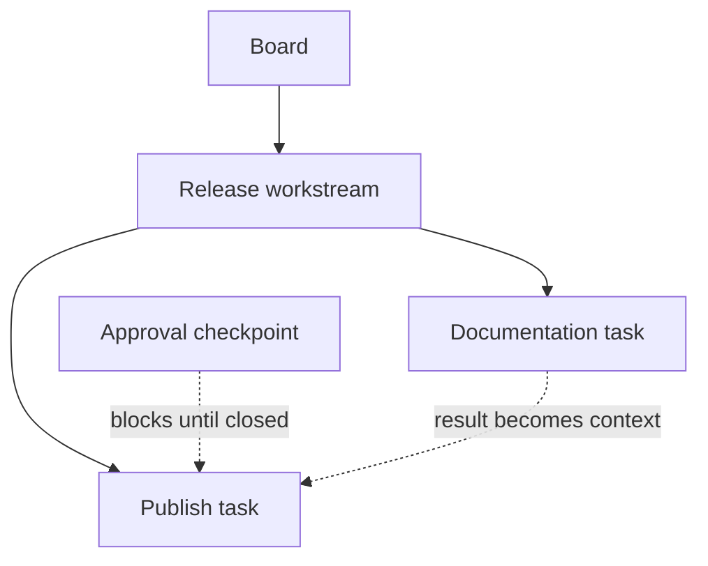

# Concepts and issue context

Cardamom gives agents a durable graph of work
and a predictable context envelope for each claim.
The graph describes deliverables and ordering.
Claims describe temporary custody.
Issue records preserve the information needed across handoffs.

## The issue graph

Every issue belongs to one board.
A workstream may contain other workstreams, tasks, checkpoints, and routines.
Containment and dependencies answer different questions:

| Relationship | Question | Effect |
| --- | --- | --- |
| Parent | Which deliverable owns this issue? | Adds hierarchy and inherited context. |
| Dependency | Which outcome must exist first? | Blocks readiness and supplies the prerequisite result. |



Use a parent when issues belong to one acceptance boundary.
Use a dependency when later work requires an earlier result.
The same pair may use both relationships when both statements are true.

## Issue types

| Type | Use |
| --- | --- |
| `workstream` | A finite deliverable with persistent context, children, or its own acceptance boundary |
| `task` | A bounded part of a deliverable that benefits from separate ownership |
| `checkpoint` | A required approve-or-deny decision |
| `routine` | A reusable operating contract awakened and scheduled outside Cardamom |

Workstreams and routines are executable.
A small deliverable may be claimed directly as a workstream
without creating a task merely to hold the implementation.
Routines are claimed explicitly by ID and do not appear in automatic claim
pools.

## Context on claim

Claim with `--context` when the agent needs the inherited contract:

```bash
card --actor worker-a --json claim <issue-id> --context
```

The response includes:

- the selected board description;
- ancestor summaries and current states;
- the claimed issue's summary, details, and state; and
- results from completed direct dependencies.

Ancestor details, complete logs, attachments, and terminal descendants remain
available on demand.
This progressive disclosure keeps the initial handoff small
without making deeper evidence inaccessible.

## Durable records

Each issue record serves one reader task:

| Record | Reader task |
| --- | --- |
| Title | Compact identity for lists and commands |
| Summary | Understand the minimum stable contract inherited by descendants |
| Details | Execute from stable working knowledge that remains useful across phases or executors |
| State | Work from the current operative facts, progress, active choices, constraints, blockers, and optional next action |
| Log | Reconstruct decisions, evidence, and committed State snapshots |
| Result | Inspect the completed outcome and validation |

Summary, Details, and Log form a progressive disclosure ladder
for stable knowledge and history.
Summary travels with descendants,
Details add the issue's stable working knowledge,
and Log adds history when a reader must reconstruct how the work reached its
current position.
State sits alongside that ladder as the issue's persistent mutable active
memory.
It is included with the current issue
and in the inherited context supplied by ancestor issues.
A worker updates State as the operative position changes during execution.
Because State persists across claims,
the same record lets another executor resume after an interruption.
Result owns the completed outcome.

Information changes records when its meaning changes.
Current investigation, progress, and phase-specific choices belong in State
while they govern execution.
Replacing State moves the active working position forward
without preserving the displaced version.
When a phase produces a coherent outcome,
a commit snapshots the current State into Log
while replacing or clearing the active State for what follows.
Replay-worthy evidence or reasoning not represented by a snapshot belongs in a
standalone Log entry.
When a finding becomes stable guidance that should remain useful after State
advances,
its conclusion belongs in Details.
When descendants need the conclusion in inherited context,
a concise version belongs in the Summary of the issue whose descendants need
it.
Summary and Details edits replace the complete selected record.
Read its current value and retain every still-operative part when incorporating
a conclusion.

Replace State whenever the current working position or planned transition
changes.
Keep the operative facts in the State body
and pass the optional planned transition with `--next`.
When archive verification becomes a coherent phase outcome,
record that outcome in State,
then commit it while installing the active State for publication:

```bash
card --actor worker-a state set "$issue" \
  "The signed release archive is verified."
card --actor worker-a state commit "$issue" \
  --set "The verified archive is ready for publication." \
  --next "Publish the release notes."
```

The commit preserves the verified-archive State in Log
and makes publication the current working position.
When a coherent phase ends with no remaining active work,
use bare `state commit` to snapshot and clear State.
Use `log post` only for additional replay-worthy reasoning or evidence
that the State snapshot does not represent.

Mail is expiring communication,
not an issue record.
Attachments preserve file bytes,
but the issue record must still explain what those bytes establish.

## Lifecycle and custody

Issue lifecycle is `open`, `closed`, or `cancelled`.
An active claim is separate from lifecycle.
Presentation shows an open claimed issue as `in_progress`,
but only the claiming actor owns custody.

Choose the transition that matches the next reader:

| Situation | Operation |
| --- | --- |
| A coherent phase ends and another begins | Commit current State while installing the next State with `state commit --set`. |
| A coherent phase ends without another active position | Commit current State and clear it with bare `state commit`. |
| Work is complete under the current actor | Set a result when useful, keep final State current, then `close`. |
| Any eligible worker may continue | Keep State and its optional next action current, then ordinary `release`. |
| A named acceptor or external event acts next | Set a useful result or current working position, then `release --waiting "<reason>"`. |
| Work is no longer valid | Inspect dependent cancellation impact, keep State current, then `cancel`. |

Release and terminal lifecycle operations preserve changed State
as a Log snapshot automatically.
Do not run `state commit` only to prepare for one of those operations.

Claims do not expire because an actor is silent.
Waiting issues remain open and unclaimed,
but automatic claim pools omit them until a direct claim resumes the issue.
