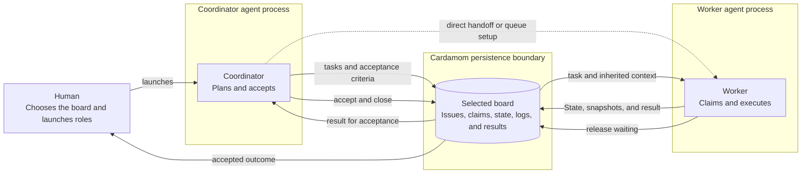

# Workflow recipes

Every recipe uses the same durable lifecycle:
a human launches agent processes,
agents exchange tasks and results through Cardamom,
and an acceptor closes completed work.

During execution,
State holds current recovery truth and an optional `--next` transition.
Workers commit a completed position when it must remain recoverable after
State changes or ends.
Release and terminal lifecycle operations preserve changed State automatically;
standalone Log posts hold only additional replay-worthy material.

Choose the topology that matches how work should be routed:

| Pattern | Human setup choice | Task routing |
| --- | --- | --- |
| [Coordinator and worker agents](coordinator-workers.md) | One coordinator and a worker process for each assigned task | The coordinator sends each worker a specific issue ID. |
| [Shared work queue](shared-work-queue.md) | One coordinator and several equivalent worker processes | Each worker atomically claims any matching ready issue. |
| [Specialist agents](specialist-agents.md) | One coordinator and a process for each required capability | Dependencies release capability-specific work in order. |

Start Claude or Codex in the project with the Cardamom skill installed
and the intended board selected.
Different roles may use different agent runtimes.
Give every concurrent process a distinct, stable actor identity.
