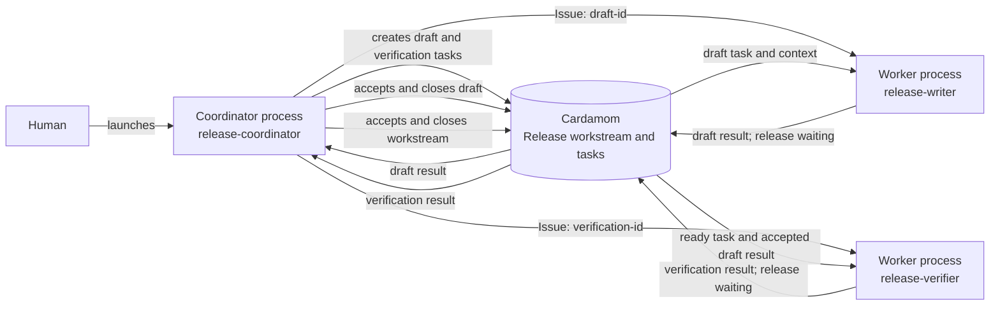

# Coordinator and worker agents

Use this pattern when one coordinator defines a deliverable,
dispatches bounded tasks,
and retains the acceptance boundary.



## Human setup

Start one coordinator process with the selected board.
The coordinator plans the workstream,
dispatches tasks,
and owns acceptance.
For each ready task,
start a worker process with its own actor identity
and the issue ID supplied by the coordinator.

Replace angle-bracket placeholders before launching an agent.

<details>
<summary>Coordinator prompt</summary>

```text
Use the Cardamom skill as the governing coordination protocol.
Work on the selected board as actor release-coordinator.
Coordinate preparation and publication of the 1.5 release.
Create one workstream with a task to draft release notes from accepted changes
and a dependent task to verify the notes against the release archive.
Dispatch each task to a worker with its own stable actor identity.
Retain responsibility for accepting worker results and closing the workstream.
```

</details>

<details>
<summary>Directed worker prompt</summary>

```text
Store: <store-path>
Board: <board-id-or-name>
Issue: <issue-id>

Use the Cardamom skill as the governing coordination protocol.
Work in the project as actor release-writer.
Use the Cardamom store and board above.
Claim issue <issue-id> by ID with inherited context.
Complete the assigned release task.
Keep State aligned with current recovery truth
and put an optional planned transition in `--next`.
Commit State at durable checkpoints.
Use standalone Log posts only for replay-worthy material
that State snapshots do not represent.
Set a useful result and release the task waiting for coordinator acceptance.
```

</details>

## After launch

The coordinator stores the deliverable and acceptance criteria in the
workstream,
then gives each worker a specific issue ID.
The worker claims that ID with context,
keeps State current,
commits durable checkpoints,
sets a result,
and releases waiting.
Release preserves any changed final State automatically.

The coordinator inspects each result,
records acceptance,
and closes the task.
Closing the drafting task makes the dependent verification task ready
and supplies the accepted drafting result as claim context.
The coordinator closes the workstream after every direct child is closed
or cancelled.
