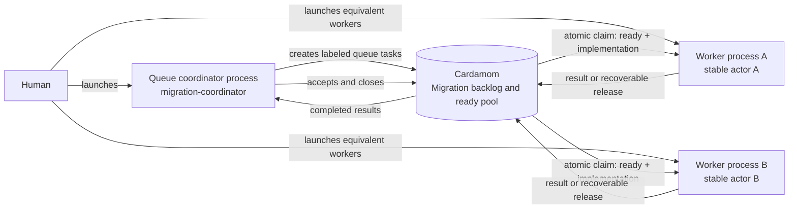

# Shared work queue

Use this pattern when several equivalent workers may claim the next ready item
without a coordinator assigning a specific issue.



## Human setup

Start one coordinator process to define the workstream and acceptance criteria.
Then start one process per equivalent worker.
Give every worker the same role prompt,
but require each process to choose a distinct actor identity.

<details>
<summary>Queue coordinator prompt</summary>

```text
Use the Cardamom skill as the governing coordination protocol.
Work on the selected board as actor migration-coordinator.
Create or reconcile a Migration backlog workstream.
Add independently claimable tasks for migrating customer preferences and
notification settings, and label both tasks implementation.
Define acceptance criteria, but do not assign tasks to particular workers.
Accept completed results and close the workstream after its tasks are closed.
```

</details>

<details>
<summary>Shared worker prompt</summary>

```text
Use the Cardamom skill as the governing coordination protocol.
Work on the selected board.
Before the first Cardamom command, choose a stable actor identity that
distinguishes this session from every concurrent migration worker.
Find the Migration backlog workstream and atomically claim one ready task under
it with the implementation label and inherited context.
Carry out the claimed task and keep State aligned with current recovery truth.
Put an optional planned transition in `--next`
and commit a completed position when it must remain recoverable after State
changes or ends; use `--set` when another active position follows.
Use standalone Log posts only for replay-worthy material
that State snapshots do not represent.
If any migration worker may resume unfinished work, release it to the pool.
When the task is complete, set a useful result and release it waiting for
migration-coordinator acceptance.
```

</details>

## After launch

Containment limits the claim pool to one deliverable,
and labels select the kind of work each worker may claim.
Dependencies alone control readiness.
Each atomic claim gives one ready issue to one worker.

An ordinary release returns unfinished work to the pool after the worker
records current State and an optional next action.
Release preserves changed State automatically.
Completed work receives a result and waiting status instead.
The coordinator inspects each completed result,
records acceptance,
and closes the issue without taking execution custody.
