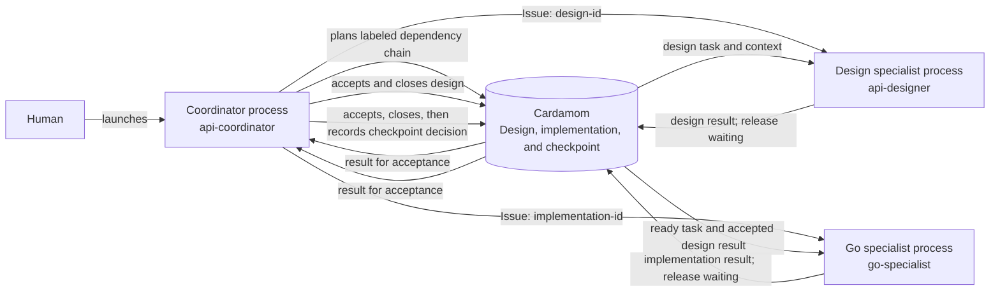

# Specialist agents

Use this pattern when different agents own distinct capabilities
and later work depends on earlier specialist results.



## Human setup

Start one coordinator process to define the capability labels,
dependency order,
and acceptance criteria.
When a specialist task becomes ready,
start a process with that capability and give it the assigned issue ID.

Replace angle-bracket placeholders before launching a specialist.

<details>
<summary>Specialist coordinator prompt</summary>

```text
Use the Cardamom skill as the governing coordination protocol.
Work on the selected board as actor api-coordinator.
Plan delivery of an API change as a design task, a dependent Go implementation
task, and a final approval checkpoint.
Label the design task design and the implementation task go.
Define the public contract and acceptance criteria in the issue summaries.
Accept each specialist result before closing its task.
Keep the final authority decision at the checkpoint.
```

</details>

<details>
<summary>Design specialist prompt</summary>

```text
Store: <store-path>
Board: <board-id-or-name>
Issue: <issue-id>

Use the Cardamom skill as the governing coordination protocol.
Work in the project as actor api-designer.
Use the Cardamom store and board above.
Claim issue <issue-id> by ID with inherited context.
Define the public request and response contract.
Keep State aligned with current recovery truth
and put an optional planned transition in `--next`.
Commit a completed position when it must remain recoverable after State changes
or ends; use `--set` when another active position follows.
Use standalone Log posts only for replay-worthy material
that State snapshots do not represent.
Set the design result and release the task waiting for api-coordinator
acceptance.
```

</details>

<details>
<summary>Go specialist prompt</summary>

```text
Store: <store-path>
Board: <board-id-or-name>
Issue: <issue-id>

Use the Cardamom skill as the governing coordination protocol.
Work in the project as actor go-specialist.
Use the Cardamom store and board above.
Claim issue <issue-id> by ID with inherited context.
Implement the accepted API contract and its contract tests.
Keep State aligned with current recovery truth
and put an optional planned transition in `--next`.
Commit a completed position when it must remain recoverable after State changes
or ends; use `--set` when another active position follows.
Use standalone Log posts only for replay-worthy material
that State snapshots do not represent.
Set the implementation result and release the task waiting for api-coordinator
acceptance.
```

</details>

## After launch

Labels identify the capability required for each task.
Dependencies,
not labels,
control when the next task becomes ready.
Each specialist claims the assigned issue ID,
records a result,
and releases waiting for coordinator acceptance.

Closing the design task makes implementation ready.
The implementation claim context includes the accepted design result,
so the handoff does not depend on chat history.
After implementation closes,
the checkpoint becomes actionable
and Cardamom records the authority decision established by the surrounding
process.
